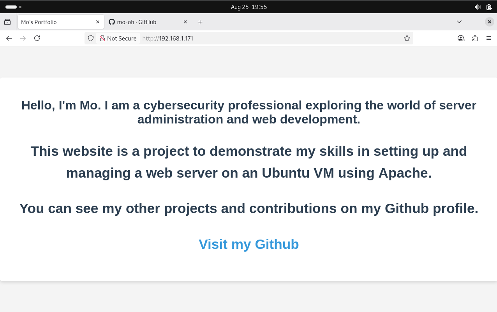

# 🌈 Local Apache Server Portfolio

[](https://ubuntu.com/)
[](https://httpd.apache.org/)
[](https://www.virtualbox.org/)
[](https://developer.mozilla.org/docs/Web/HTML)
[](https://www.gnu.org/software/bash/)

---

## 🎯 Project Overview

I set up a personal portfolio website hosted on an Apache web server running on an Ubuntu VM (using VirtualBox). The website is accessible from my host machine via the VM's local IP address.  
This project demonstrates my skills in system administration, web server configuration, and basic networking. 🚀

---

## 🛠️ Technologies Used

- 🐧 **Ubuntu** (VirtualBox VM)
- 📦 **VirtualBox**
- 🅰️ **Apache2**
- 🌐 **HTML**
- 🖥️ **Bash**

---

## 📋 What I Did

### 1️⃣ Prepared the Ubuntu VM & Installed Apache

I started by updating and upgrading my Ubuntu VM:

```bash
sudo apt update
sudo apt upgrade
```

Then, I installed Apache2 and verified that it was running:

```bash
sudo apt install apache2
sudo systemctl status apache2
```
Apache showed as `active (running)`.

---

### 2️⃣ Built My Portfolio Website

I navigated to the web root:

```bash
cd /var/www/html
```

Using `nano`, I created a custom `index.html` for my personal portfolio (see [`index.html`](index.html)).  
I set the correct file permissions so Apache could serve my files:

```bash
sudo chown -R www-data:www-data /var/www/html
```

---

### 3️⃣ Accessed the Website Locally

To find my VM’s IP address, I ran:

```bash
ifconfig
```

I then opened a browser on my host machine and entered the VM’s IP, successfully accessing the portfolio site.

---

### 4️⃣ Admire my first webpage



---

## 🌐 Networking Concepts Demonstrated

- The VM and host machine are on the same bridged network.
- By entering the VM’s IP in my host’s browser, I demonstrated internal network access and understanding of network interfaces, IP addresses, and local web hosting.

---

## 📂 Repository Contents

- [`portfolio/index.html`](portfolio/index.html): The screenshot of the portfolio.
- [`screenshots/`](screenshots/): Example output and banner images.

---

## 🧑‍💻 Author

[Mo](https://github.com/mo-oh)

---

> Made with ❤️ on Ubuntu!
